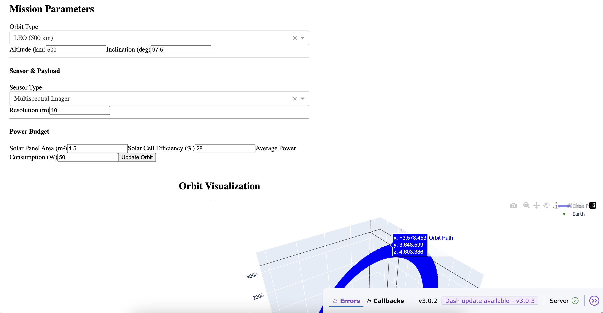

### SmallSat Mission Planner
<i>WIP</i> 
This project uses poliastro and plotly to calculate, model and graph user inputted parameters for planning a satellite launch.
 
Frontend served with dash.
 

<ul>
<h4>Features:</h4>
<li>Sensor type</li>
<li>Sensor resolution</li>
<li>Solar area, efficiency</li>
<li>Power consumption</li>
<li>Mission duration</li>
</ul>